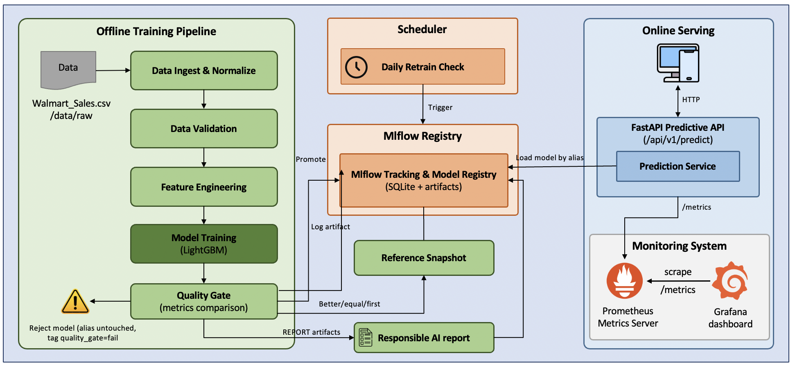
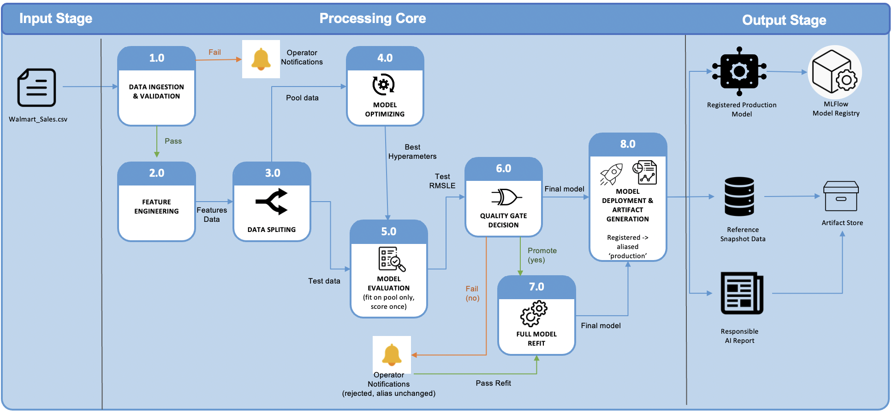

# System Architecture

See also: [docs/PROBLEM_DEFINITION.md](docs/PROBLEM_DEFINITION.md) for the
requirements this design satisfies, and [docs/USER_GUIDE.md](docs/USER_GUIDE.md)
for how to run it.

## 1. High-level architecture

The system has two decoupled halves: an **offline/training** pipeline that
runs on demand (or on a schedule) and an **online/serving** stack that runs
continuously. A third, small piece — the **scheduler** — bridges them: it
runs continuously but only *triggers* the offline pipeline, once the
production model is stale enough.

## 2. Component responsibilities
The system is organized into an offline training pipeline and an online serving stack. The components below show the main offline path from raw CSV to promoted model and report artifacts.

| Group | Component | Responsibility | Input | Output |
|---|---|---|---|---|
| Offline training pipeline | Data Ingest & Normalize | Load the raw CSV, rename/type columns, and sort into a clean weekly panel | `Walmart_Sales.csv` / `data/raw` | Normalized Data Ingest |
| Offline training pipeline | Data Validation | Schema, null, range, duplicate, and panel-balance checks; fails the pipeline loudly on violation | Normalized Data Ingest | Validated Dataset |
| Offline training pipeline | Feature Engineering | Calendar features, lag/rolling sales features, and rule-based holiday-week detection - applied identically at train and serve time | Validated Dataset | Feature Set |
| Offline training pipeline | Model Training | Executes model training, cross-validation, and hyperparameter optimization | Feature Set | Candidate Model, Training Metrics |
| Offline training pipeline | Quality Gate | Mandatory gate comparing candidate metrics (e.g., `test_rmsle`) against the current `production` model | Candidate Metrics, MLflow Production Metrics | Decision (Promote/Reject) |
| Offline training pipeline | Reference Snapshot | Generates and persists a point-in-time snapshot of features used for training | Validated Dataset | Reference Snapshot / `data/processed` |
| Offline training pipeline | Responsible AI Reporting | Generates explainability (SHAP) and fairness reports for the candidate model | Candidate Model, Feature Set | Responsible AI Report |
| MLflow Registry | MLflow Tracking | Records metadata from the training stack, including training parameters and metric logs | Metric Logs (Training Stack) | Stored Metadata |
| MLflow Registry | Model Registry | Manages model versioning and lifecycle stages (Staging, Production) using aliases | Candidate Model, Responsible AI Report | Versioned Models, Registered `Production` Alias |
| MLflow Registry | Artifact Store (SQLite + DB) | Persists physical model binary files and reports | Model Binaries, `.md` Reports | Persisted Artifacts |
| Scheduler | Daily Retrain Check | Checks the age of the production model once a day; forces a retrain attempt (still subject to the quality gate) once it's ≥ `RETRAIN_MAX_AGE_DAYS` (default 7) days old | Current Time, MLflow Production Timestamp | Retrain Decision (Yes/No) |
| Online serving | FastAPI Predictive API | Exposes the `/api/v1/predict` endpoint and manages concurrent HTTP request lifecycle | Client POST Request | HTTP Prediction Response |
| Online serving | Prediction Service | Encapsulates the core inference logic, loading the model and performing preprocessing | Client Input Data | Raw Prediction |
| Online serving | Artifact Loader | Hot-loads the `Production` model alias from MLflow and maps reference snapshots as volumes | MLflow Registry (Production alias), Reference Snapshot (Read-Only Volume) | Loaded Model Object, Feature Reference Data |
| Online serving | Metrics Exporter | Exposes an internal `/metrics` endpoint for Prometheus scraping | Request latency, Prediction distribution | Prometheus compatible Metrics |
| Monitoring System | Prometheus/Grafana | Provides observability by scraping `/metrics` for system health and model performance dashboards | Metrics Exported by API | Monitoring Dashboards / Alerting Views |

## 3. Data flow

Note: `SNAP` and `RAI` only run when the gate promotes — a rejected
candidate leaves `data/processed/` and `reports/` exactly as they were
after the last successful promotion (see `run_training_pipeline()` in
[`scripts/run_pipeline.py`](scripts/run_pipeline.py)).

Trigger: either a manual `python scripts/run_pipeline.py`, or an automatic
attempt from `scripts/retrain_if_stale.py` once the current `production`
model is ≥ `RETRAIN_MAX_AGE_DAYS` old — both paths go through the same gate
above, so a scheduled retrain can never bypass it.

See [README.md § Train / CV / Test split](README.md#train--cv--test-split)
for the full walkthrough with real dates and real numbers from the last run.

**At serving time**, a request `(store_nbr, date)` is turned into a feature
row by combining: (a) the store's most recent lag/rolling sales values and
economic indicators (temperature/fuel price/CPI/unemployment) from the
snapshot, with (b) calendar features computed fresh for the requested date
and a rule-based holiday-week flag — unless the caller overrides any of
these with an actual forecast. See §5 for why the snapshot approach is a
deliberate simplification.

## 4. Technology stack & justification

| Choice | Why |
|---|---|
| **Python 3.10** | Required by the assignment; stable, wide library support (LightGBM, MLflow, FastAPI, SHAP all fully compatible). |
| **LightGBM (gradient boosting)** | Explicitly listed as an accepted approach for this topic; strong tabular baseline, trains on the full dataset in well under a minute, handles missing lag values (early-week NaNs) natively — far less operational complexity than an LSTM or Prophet for a ~6.4K-row dataset, matching the "keep it lean" goal. |
| **MLflow (SQLite backend)** | Full experiment tracking + model registry (params, metrics, artifacts, aliasing) without standing up a separate database service — appropriate for a single-team course project. |
| **FastAPI** | Async, typed, auto-generates OpenAPI/Swagger docs for free, integrates cleanly with `prometheus-fastapi-instrumentator`. |
| **Docker / Docker Compose** | Reproducible, one-command local deployment of API + MLflow + retrain `scheduler` + Prometheus + Grafana; satisfies the containerization/orchestration rubric without needing Kubernetes for a project this size. |
| **Prometheus + Grafana** | Industry-standard, self-hosted, no external SaaS dependency — works fully offline for grading. |
| **GitHub Actions** | Free for public repos, matches the required `.github/workflows/` deliverable. |
| **pytest + pytest-cov** | Standard, supports the four required test categories (unit/integration/data/model) cleanly via directories + fixtures. |
| **SHAP** | Model-agnostic but has a fast exact `TreeExplainer` path for LightGBM; industry-standard explainability choice named directly in the rubric. |

## 5. Trade-offs

| Decision | Trade-off | Why it's the right call here |
|---|---|---|
| **One global model** (not per-store models) | Slightly lower ceiling accuracy than 45 specialized models | Vastly simpler to train, register, monitor, and reason about; `store_nbr` as a categorical feature lets LightGBM learn store-specific patterns anyway — and with only ~143 weeks/store, per-store models would have very little data each |
| **Final model refit on 100% of data** (including the held-out test weeks) after the honest test score is recorded | The registered model's accuracy is never independently re-verified after this refit — we trust that adding 8 more recent weeks doesn't change behavior much | For a time series, the most recent weeks are the most informative for next-week forecasts; discarding them from the deployed model just to keep a permanent holdout would hurt real-world accuracy for a course-scope one-time evaluation |
| **Snapshot-based serving features** (lag/rolling values and economic indicators frozen at last training date) instead of live feeds | Forecast quality for lag features and economic indicators slowly goes stale between retrains; the caller can override any of them if they have a better estimate | Avoids standing up a streaming feature store / live economic-data feed for a course-scope project; documented retraining cadence (§ USER_GUIDE) mitigates staleness |
| **Rule-based holiday-week detection** (Super Bowl/Labor Day/Thanksgiving/Christmas via standard US scheduling rules) instead of a holiday-calendar file | An approximation, not an official calendar; caller can override via `holiday_flag` | The dataset ships no holiday-calendar file; the rule was verified to reproduce all 10 `holiday_flag=1` weeks actually present in the source data exactly (see `tests/unit/test_features.py`), and generalizes to any future year without a new data dependency |
| **SQLite MLflow backend** instead of Postgres | Lower write-concurrency ceiling | Single-team, low-concurrency training workload; SQLite still gives the full registry + tracking feature set with zero extra services |
| **Prometheus alert *rules* only**, no Alertmanager service | Alerts are visible in the Prometheus UI but not routed to Slack/email/PagerDuty | Keeps the compose stack to 5 services instead of 6+; routing is a well-documented, low-effort extension (`alertmanager.yml` + one more compose service) if needed later |
| **Local filesystem artifact storage** (Docker volumes), not S3/GCS | Not durable across host loss; not multi-region | No cloud account required to run/grade the project; swapping `--artifacts-destination` for an S3 URI is a one-line change if ever needed |
| **Batch prediction capped at 500 items** | Very large batches need multiple calls | Keeps request/response payloads and latency predictable; 500 covers many full planning-horizon batches at once (45 stores x 11 weeks) |
| **Quality gate compares held-out TEST RMSLE only** (not CV score, not a full suite of metrics/bias checks) | A candidate could win on RMSLE while regressing on a metric nobody's watching (e.g. one store type) | Matches the one "honest" number defined in [Train / CV / Test split](README.md#train--cv--test-split); the fairness report still runs on every promoted model so segment regressions stay visible, just not gate-blocking yet |
| **Scheduler polls once a day** (`--check-interval-hours 24`), not event-driven on data arrival | A retrain triggered by staleness can lag up to ~24h behind the exact 7-day boundary | Simple, dependency-free (`time.sleep` loop, one container, no message queue/cron infra); the boundary is inclusive (`age >= 7 days` counts as due) so it never *waits longer* than intended, only occasionally checks a few hours late |
| **`data/raw/Walmart_Sales.csv` has no version control of its own** (gitignored — see README § Data lineage) | Can't `git diff` two raw-data snapshots, or list every version a file ever had | Full-file overwrite (not incremental append) plus a SHA256 + row-count + date-range fingerprint logged as MLflow tags on every promoted run is enough to answer "which exact data produced this model" without committing a large, Kaggle-licensed, ever-growing CSV to git; heavier tooling (DVC, a lakehouse) would be disproportionate for a 6.4K-row course dataset |
