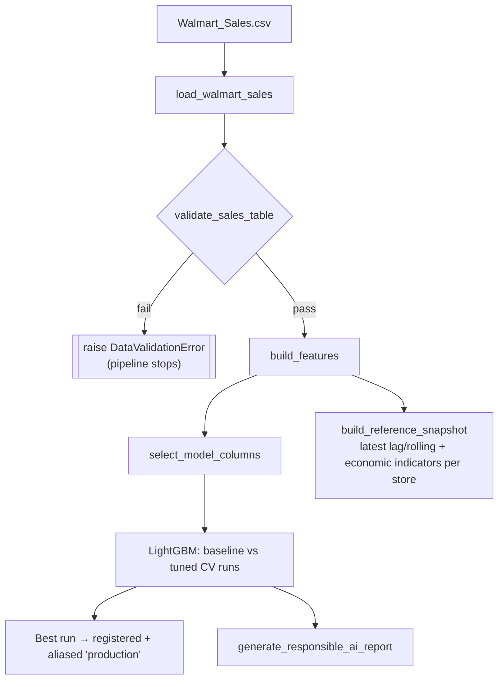

# System Architecture

See also: [docs/PROBLEM_DEFINITION.md](docs/PROBLEM_DEFINITION.md) for the
requirements this design satisfies, and [docs/USER_GUIDE.md](docs/USER_GUIDE.md)
for how to run it.

## 1. High-level architecture

The system has two decoupled halves: an **offline/training** pipeline that
runs on demand (or on a schedule) and an **online/serving** stack that runs
continuously.

```mermaid
flowchart LR
    subgraph Offline["Offline — Training (batch, on-demand)"]
        RAW[("Walmart_Sales.csv\ndata/raw")] --> INGEST["Ingest & Normalize\ndata/ingest.py"]
        INGEST --> VALIDATE["Data Validation\ndata/validate.py"]
        VALIDATE --> FEAT["Feature Engineering\ndata/features.py"]
        FEAT --> TRAIN["Train + CV +\nHyperparam Search\nmodels/train.py"]
        FEAT --> SNAP["Reference Snapshot\ndata/processed"]
        TRAIN --> REPORT["Responsible AI Report\nSHAP + Fairness\nreporting.py"]
    end

    subgraph Registry["MLflow"]
        MLFLOW[("Tracking Server +\nModel Registry\n(SQLite + artifact store)")]
    end

    TRAIN -->|log params/metrics/model| MLFLOW
    REPORT -->|log artifacts| MLFLOW

    subgraph Online["Online — Serving (always-on)"]
        CLIENT(["Store Planner /\nClient app"]) -->|HTTPS| API["FastAPI\n/api/v1/predict"]
        API --> PS["PredictionService\nmodels/predict.py"]
        PS -->|load model by alias| MLFLOW
        PS -->|read snapshot\n(read-only volume)| SNAP
        API -->|/metrics| PROM[("Prometheus")]
        PROM --> GRAF["Grafana\nDashboards"]
        PROM --> ALERTS["Alert Rules"]
    end
```

## 2. Component responsibilities

| Component | Responsibility | Key files |
|---|---|---|
| **Ingestion** | Load the raw CSV, rename/type columns, sort into a clean weekly panel | [`src/demand_forecast/data/ingest.py`](src/demand_forecast/data/ingest.py) |
| **Validation** | Schema, null, range, duplicate, and panel-balance checks; fails the pipeline loudly on violation | [`src/demand_forecast/data/validate.py`](src/demand_forecast/data/validate.py) |
| **Feature engineering** | Calendar features, lag/rolling sales features, rule-based holiday-week detection — applied identically at train and serve time | [`src/demand_forecast/data/features.py`](src/demand_forecast/data/features.py) |
| **Training** | Baseline model, LightGBM + time-series CV + hyperparameter search, MLflow logging & registry promotion | [`src/demand_forecast/models/train.py`](src/demand_forecast/models/train.py) |
| **Responsible AI reporting** | SHAP + native feature importance, per-segment fairness disparity report | [`src/demand_forecast/explainability/`](src/demand_forecast/explainability/), [`src/demand_forecast/fairness/`](src/demand_forecast/fairness/), [`reporting.py`](src/demand_forecast/reporting.py) |
| **Serving** | Loads the registered model + reference snapshot, exposes REST endpoints, emits ML-specific metrics | [`src/demand_forecast/api/`](src/demand_forecast/api/) |
| **Experiment tracking / registry** | Single source of truth for runs, metrics, and the currently-serving model version (via alias `production`) | MLflow service (`Dockerfile.mlflow`) |
| **Monitoring** | Scrapes API metrics, evaluates alert rules, renders dashboards | `monitoring/prometheus/`, `monitoring/grafana/` |
| **CI/CD** | Lint → test (≥80% coverage) → Docker build on every push/PR | [`.github/workflows/ci.yml`](.github/workflows/ci.yml) |

## 3. Data flow



**At serving time**, a request `(store_nbr, date)` is turned into a feature
row by combining: (a) the store's most recent lag/rolling sales values and
economic indicators (temperature/fuel price/CPI/unemployment) from the
snapshot, with (b) calendar features computed fresh for the requested date
and a rule-based holiday-week flag — unless the caller overrides any of
these with an actual forecast. See §5 for why the snapshot approach is a
deliberate simplification.

## 4. Technology stack & justification

| Choice | Why |
|---|---|
| **Python 3.10** | Required by the assignment; stable, wide library support (LightGBM, MLflow, FastAPI, SHAP all fully compatible). |
| **LightGBM (gradient boosting)** | Explicitly listed as an accepted approach for this topic; strong tabular baseline, trains on the full dataset in well under a minute, handles missing lag values (early-week NaNs) natively — far less operational complexity than an LSTM or Prophet for a ~6.4K-row dataset, matching the "keep it lean" goal. |
| **MLflow (SQLite backend)** | Full experiment tracking + model registry (params, metrics, artifacts, aliasing) without standing up a separate database service — appropriate for a single-team course project. |
| **FastAPI** | Async, typed, auto-generates OpenAPI/Swagger docs for free, integrates cleanly with `prometheus-fastapi-instrumentator`. |
| **Docker / Docker Compose** | Reproducible, one-command local deployment of API + MLflow + Prometheus + Grafana; satisfies the containerization/orchestration rubric without needing Kubernetes for a project this size. |
| **Prometheus + Grafana** | Industry-standard, self-hosted, no external SaaS dependency — works fully offline for grading. |
| **GitHub Actions** | Free for public repos, matches the required `.github/workflows/` deliverable. |
| **pytest + pytest-cov** | Standard, supports the four required test categories (unit/integration/data/model) cleanly via directories + fixtures. |
| **SHAP** | Model-agnostic but has a fast exact `TreeExplainer` path for LightGBM; industry-standard explainability choice named directly in the rubric. |

## 5. Trade-offs

| Decision | Trade-off | Why it's the right call here |
|---|---|---|
| **One global model** (not per-store models) | Slightly lower ceiling accuracy than 45 specialized models | Vastly simpler to train, register, monitor, and reason about; `store_nbr` as a categorical feature lets LightGBM learn store-specific patterns anyway — and with only ~143 weeks/store, per-store models would have very little data each |
| **Snapshot-based serving features** (lag/rolling values and economic indicators frozen at last training date) instead of live feeds | Forecast quality for lag features and economic indicators slowly goes stale between retrains; the caller can override any of them if they have a better estimate | Avoids standing up a streaming feature store / live economic-data feed for a course-scope project; documented retraining cadence (§ USER_GUIDE) mitigates staleness |
| **Rule-based holiday-week detection** (Super Bowl/Labor Day/Thanksgiving/Christmas via standard US scheduling rules) instead of a holiday-calendar file | An approximation, not an official calendar; caller can override via `holiday_flag` | The dataset ships no holiday-calendar file; the rule was verified to reproduce all 10 `holiday_flag=1` weeks actually present in the source data exactly (see `tests/unit/test_features.py`), and generalizes to any future year without a new data dependency |
| **SQLite MLflow backend** instead of Postgres | Lower write-concurrency ceiling | Single-team, low-concurrency training workload; SQLite still gives the full registry + tracking feature set with zero extra services |
| **Prometheus alert *rules* only**, no Alertmanager service | Alerts are visible in the Prometheus UI but not routed to Slack/email/PagerDuty | Keeps the compose stack to 4 services instead of 5+; routing is a well-documented, low-effort extension (`alertmanager.yml` + one more compose service) if needed later |
| **Local filesystem artifact storage** (Docker volumes), not S3/GCS | Not durable across host loss; not multi-region | No cloud account required to run/grade the project; swapping `--artifacts-destination` for an S3 URI is a one-line change if ever needed |
| **Batch prediction capped at 500 items** | Very large batches need multiple calls | Keeps request/response payloads and latency predictable; 500 covers many full planning-horizon batches at once (45 stores x 11 weeks) |
