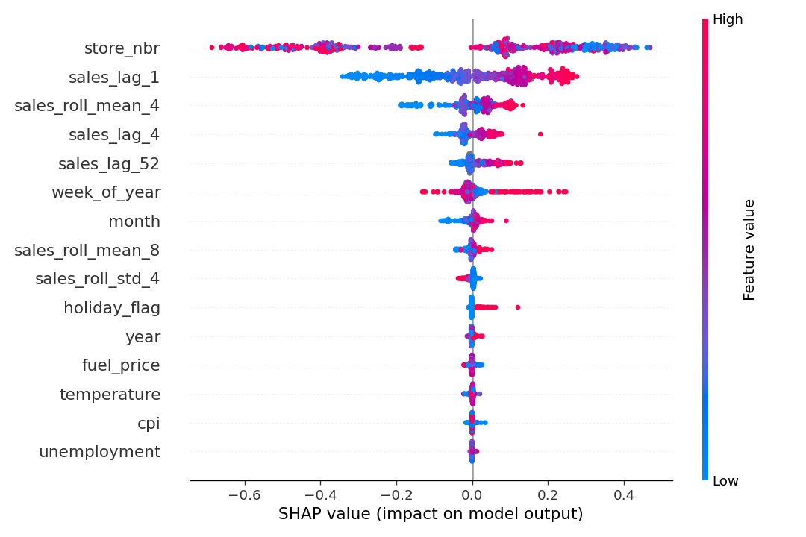
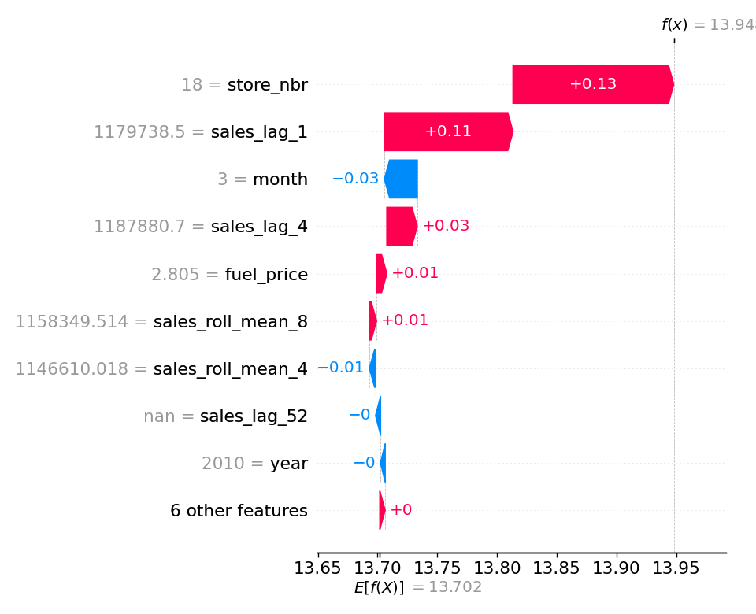

# Demand Forecasting System — Group 4 - DDM501 Final Project

> Weekly store-level sales forecasting for 45 Walmart stores, from raw data to a monitored production API.


## Overview

This project solves a weekly demand forecasting problem for Walmart stores. Store and regional planners need to estimate next-week sales so they can plan staffing, inventory, and local budgets. The system addresses the risk of under-forecasting, which leads to stock-outs and lost sales, and over-forecasting, which causes excess cost and waste.

The dataset is the Kaggle Walmart Sales dataset: 45 stores, weekly sales from 2010-02-05 to 2012-10-26, with holiday flags and economic indicators such as temperature, fuel price, CPI, and unemployment. The pipeline covers the full MLOps lifecycle: raw data ingestion, validation, feature engineering, model training with time-series cross-validation, MLflow tracking and registry promotion, FastAPI serving, and Prometheus/Grafana monitoring.

### Users and use cases

- Store and regional planners request forecasts for a store and week, then use the result for planning.
- They can optionally override holiday or economic inputs when they have better estimates.
- They can submit a batch of store-week requests for a planning horizon.
- ML and platform engineers retrain and redeploy the model without changing client code.
- On-call engineers watch API health, latency, and error rate through Prometheus and Grafana.

### Requirements snapshot

- Single-store prediction and batch prediction up to 500 requests.
- MLflow tracking for every training run.
- Explainability for at least one prediction.
- Segment-level fairness reporting.
- A one-command local deployment path with Docker Compose.
- Containerized, reproducible execution with automated CI.

### Scope and constraints

- In scope: weekly forecasts for the 45 stores in the dataset, a single global LightGBM model, local single-machine deployment, and monitored serving.
- Out of scope: SKU-level forecasting, streaming feature updates, cloud autoscaling, and forecasting stores never seen in training.
- The raw dataset is not committed to git; the pipeline fingerprints the raw file so a promoted model can still be traced back to the exact data snapshot that produced it.

## Getting Started

### Prerequisites

- Python 3.10 or newer
- Docker Desktop if you want the containerized stack
- The raw dataset file `data/raw/Walmart_Sales.csv`
- GitHub access if you want to run the CI/CD workflows or collaborate on the repo

### Running the Application

#### Local development without Docker

Use this when you want the fastest edit-run loop.

```bash
python3 -m venv .venv
source .venv/bin/activate
pip install -r requirements-dev.txt
pip install -e .
python scripts/setup_data.py
python scripts/run_pipeline.py
uvicorn demand_forecast.api.main:app --reload
```

Open the API docs at http://localhost:8000/docs.

#### Full stack with Docker

Use this when you want the same stack used for deployment and monitoring.

```bash
docker compose up -d mlflow
docker compose run --rm trainer python scripts/run_pipeline.py
docker compose up --build
```

Service URLs:

| Service | URL |
|---|---|
| API docs | http://localhost:8000/docs |
| MLflow | http://localhost:5001 |
| Prometheus | http://localhost:9090 |
| Grafana | http://localhost:3000 |

Notes:
- Host uses port `5001` for MLflow to avoid macOS AirPlay conflicts on `5000`.
- Containers still use `http://mlflow:5000` internally.
- If you already started local `uvicorn`, stop it before starting the API container.

## Usage

### Single prediction

```bash
curl -X POST http://localhost:8000/api/v1/predict \
  -H "Content-Type: application/json" \
  -d '{"store_nbr": 1, "date": "2012-12-28"}'
```

### Batch prediction

```bash
curl -X POST http://localhost:8000/api/v1/predict/batch \
  -H "Content-Type: application/json" \
  -d '{"items": [
        {"store_nbr": 1, "date": "2012-11-02"},
        {"store_nbr": 2, "date": "2012-11-09", "temperature": 55.2}
      ]}'
```

### What to watch

- `/health` shows whether the API and model are loaded.
- `/metrics` exposes Prometheus metrics for API health and model behavior.
- Grafana shows latency, error rate, prediction volume, and model freshness.
- The scheduler checks whether the production model is becoming stale and can trigger retraining.

Relevant files:
- [src/demand_forecast/api/main.py](src/demand_forecast/api/main.py)
- [src/demand_forecast/api/metrics.py](src/demand_forecast/api/metrics.py)
- [scripts/retrain_if_stale.py](scripts/retrain_if_stale.py)
- [monitoring/prometheus/alert_rules.yml](monitoring/prometheus/alert_rules.yml)

## Project structure

```text
demand-forecast/
├── src/demand_forecast/
│   ├── config.py                      # centralized settings from .env
│   ├── data/
│   │   ├── ingest.py                  # load + normalize Walmart_Sales.csv
│   │   ├── validate.py                # schema/null/range/duplicate checks
│   │   ├── features.py                # calendar + lag/rolling feature engineering
│   │   └── snapshot.py                # build/load reference snapshot for serving
│   ├── models/
│   │   ├── train.py                   # LightGBM train + CV + holdout + quality gate + MLflow
│   │   ├── predict.py                 # production model loading + inference service
│   │   └── evaluate.py                # RMSLE/MAE/RMSE metrics
│   ├── api/
│   │   ├── main.py                    # FastAPI app: /health, /predict, /predict/batch, /metrics
│   │   ├── schemas.py                 # pydantic request/response schemas
│   │   └── metrics.py                 # custom Prometheus metrics
│   ├── fairness/
│   │   └── fairness_report.py         # subgroup disparity and fairness analysis
│   ├── explainability/
│   │   └── shap_explain.py            # SHAP + native gain explainability helpers
│   └── reporting.py                   # Responsible AI artifact generation
├── scripts/
│   ├── setup_data.py                  # extract walmart_sales.zip to data/raw
│   ├── run_pipeline.py                # end-to-end offline pipeline entrypoint
│   └── retrain_if_stale.py            # scheduled retrain trigger by model age
├── tests/
│   ├── unit/                          # features, ingest, evaluate, snapshot, RAI, scheduler helpers
│   ├── data/                          # data-quality validation tests
│   ├── model/                         # quality gate and model behavior tests
│   ├── integration/                   # FastAPI endpoint and metrics integration tests
│   └── conftest.py                    # shared fixtures and isolated test environment
├── monitoring/
│   ├── prometheus/
│   │   ├── prometheus.yml             # scrape config
│   │   └── alert_rules.yml            # alert definitions
│   └── grafana/
│       ├── dashboards/                # demand_forecast dashboard JSON
│       └── provisioning/              # Grafana datasource + dashboard provisioning
├── docs/                              # USER_GUIDE, RESPONSIBLE_AI, CI/CD docs, architecture images
├── data/
│   ├── raw/                           # raw dataset (gitignored)
│   └── processed/                     # generated reference snapshot for serving
├── reports/                           # generated fairness and explainability artifacts
├── .github/workflows/                 # CI and local CD workflows
├── Dockerfile
├── Dockerfile.mlflow
└── docker-compose.yml
```

## Architecture
### High Level Architecture
See [ARCHITECTURE.md](ARCHITECTURE.md)
### Training flow

The offline pipeline is chronological, not random:

1. Ingest and normalize the raw CSV.
2. Validate schema, missing values, and date ordering.
3. Build lag and rolling features.
4. Run rolling-origin cross-validation on the train/CV pool.
5. Evaluate once on the locked holdout test weeks.
6. Compare against the current production model.
7. Promote only if the quality gate passes.
8. Refit on all data, log artifacts, and update the production alias.

The core implementation lives in [src/demand_forecast/models/train.py](src/demand_forecast/models/train.py) and is launched from [scripts/run_pipeline.py](scripts/run_pipeline.py).

### Serving flow

The online API is a FastAPI app in [src/demand_forecast/api/main.py](src/demand_forecast/api/main.py).
It loads the production model at startup, exposes `/health`, `/api/v1/predict`, `/api/v1/predict/batch`, and `/metrics`, and publishes custom Prometheus metrics for prediction count, prediction errors, latency, predicted sales, model status, and model age.

### Monitoring flow

- Prometheus scrapes the API `/metrics` endpoint.
- Grafana reads from Prometheus and displays the dashboard.
- Alert rules watch for API downtime, high latency, high error rate, missing traffic, missing model, and model staleness.
- The monitoring stack is defined under [monitoring/](monitoring/).

### Responsible AI

The training pipeline also generates explainability and fairness artifacts. SHAP is used for model explainability, while the fairness report summarizes segment-level disparity.
See [docs/RESPONSIBLE_AI.md](docs/RESPONSIBLE_AI.md) and [src/demand_forecast/reporting.py](src/demand_forecast/reporting.py).
 


## CI/CD

### Continuous integration

The CI workflow runs linting, tests, coverage, and Docker build checks in GitHub Actions.
See [.github/workflows/ci.yml](.github/workflows/ci.yml).

### Continuous deployment

The local CD flow runs on a self-hosted macOS runner after CI succeeds on `main`. It deploys the stack, checks health, bootstraps data if needed, retrains if the model is missing, restarts the API, and runs a smoke test.
See [docs/CI_CD_LOCAL.md](docs/CI_CD_LOCAL.md) and [.github/workflows/cd-local.yml](.github/workflows/cd-local.yml).

### Testing

```bash
pytest --cov=src --cov-report=term-missing
ruff check src tests scripts
black --check src tests scripts
```

### Team

See [CONTRIBUTING.md](CONTRIBUTING.md) for team roles, git workflow, and contribution rules.
